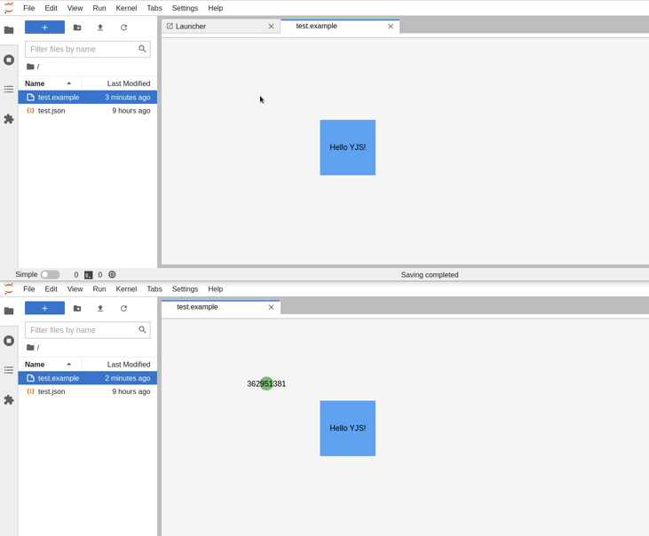

# Documents

> Create new documents and make them collaborative.



> Before starting this guide, we strongly recommend to look at the documentation, precisely the section of [Documents](https://jupyterlab.readthedocs.io/en/stable/extension/documents.html#documents)

- [Documents](#documents)
  - [Introduction to documents](#introduction-to-documents)
  - [Factories](#factories)
  - [Registering new Documents](#registering-new-documents)
  - [Document Widget](#document-widget)
  - [Document Model](#document-model)
  - [Shared Model](#shared-model)

## Introduction to documents

In JupyterLab, we refer as a document to those widgets backed by a file stored on disk. This files are represented in the frontend by a `Context` which is the bridge between the file and its model, `DocumentModel` that represents the data in the file and `DocumentWidget` which is the view of the model. To make the documents API extensible to enable other developers write new extensions to support different file types, JupyterLab introduces the `DocumentRegistry` where you can register new `FileType`s, `DocumentModel`s and `DocumentWidget`s. This way, when opening a new file the `DocumentManager` will look into the file metadata and create an instance of the right `DocumentModel` for this file. To register new documents, you can create factories, either a `ModelFactory` for the model or a `WidgetFactory` for the view.

## Factories

In the case of the `WidgetFactory`, you can create a new factory by extending from the `ABCWidgetFactory<T,U>` and overwrite its method `createNewWidget` to create your custom widget for the view, this method receives as an argument the context which includes the model.

```ts
// src/factory.ts#L25-L32

protected createNewWidget(context: DocumentRegistry.IContext<ExampleDocModel>): ExampleDocWidget {
  return new ExampleDocWidget({
    context,
    content: new ExamplePanel(context)
  });
}
```

In the other hand, to create a `ModelFactory` you need to implement the interface `IModelFactory<T>` specifying the name of your model, which type of files represents and its format.

```ts
// src/factory.ts#L37-L56

/**
 * The name of the model.
 */
get name(): string {
  return 'example';
}

/**
 * The content type of the file.
 */
get contentType(): Contents.ContentType {
  return 'file';
}

/**
 * The format of the file.
 */
get fileFormat(): Contents.FileFormat {
  return 'text';
}
```

At the same time, you need to implement the method `createNew`. The `DocumentManager` will call this method
when opening a file with a `DocumentWidget` that uses your custom `DocumentModel`.

```ts
// src/factory.ts#L73-L78

createNew(
  languagePreference?: string,
  modelDB?: IModelDB
): ExampleDocModel {
  return new ExampleDocModel(languagePreference, modelDB);
}
```

## Registering new Documents

When registering new documents, the key component is the `WidgetFactory`, the `WidgetFactory` specifies for which file type you want to add a new view and which `DocumentModel` you want to use to represent the file. In case you want to handle kernels from your widget, there is some other properties you can add like `canStartKernel` and `preferKernel` to tell the widget to start a new kernel for this document.

```ts
// src/index.ts#L50-L55

const widgetFactory = new ExampleWidgetFactory({
  name: FACTORY,
  modelName: 'example-model',
  fileTypes: ['example'],
  defaultFor: ['example']
});
```

In second place, in case you want to add a new type of file, you can use the `docRegistry.addFileType` API where the important arguments are `extensions` to indicate the extension of the file, `fileFormat` that specifies the format of the data, and `contentType` to specify if it is a notebook, file or directory.

```ts
// src/index.ts#L72-L79

app.docRegistry.addFileType({
  name: 'example',
  displayName: 'Example',
  mimeTypes: ['text/json', 'application/json'],
  extensions: ['.example'],
  fileFormat: 'text',
  contentType: 'file'
});
```

The last step, consist on registering the `ModelFactory` using the API `docRegistry.addModelFactory`.

```ts
// src/index.ts#L68-L69

const modelFactory = new ExampleDocModelFactory();
app.docRegistry.addModelFactory(modelFactory);
```

## Document Widget

The `DocumentWidget` is the view that will be opened when opening the file. The `DocumentWidget` contains four main attributes:

- `context`: The context which is the bridge between the file on disk and its representation on the frontend, this context contains all the information about the file and some methods to handle the file as its content. Some other attributes you can find on the context are the `DocumentModel` and the `sessionContext` which handles the communication with the backend.
- `title`: Which handles the content of the tab.
- `toolbar`: The toolbar of the editor, where you can add different widgets to trigger actions on the document.
- `contentHeader`: Which is a panel between the toolbar an the main content area. You can see this header as a second toolbar or as a notification area.
- `content`: The content is the main area of the `DocumentWidget` when you will add the view for your document.

## Document Model

The `DocumentModel` represents the file in the frontend. Through the model, you can listen to changes on the state of the file like its metadata or some other properties like `dirty` that indicates that the content differs from disk, and you can modify and listen to changes on the content. The main methods on the `DocumentModel` are `toString` and `fromString`, every file but the notebook is loaded/saved to disk as a string using these methods.

## Shared Model

In JupyterLab v3.1, we introduced the shared models with the intention of swapping `ModelDB` as a data storage to make the notebooks collaborative. The implementation is done using [Yjs](https://yjs.dev) which is a high-performance CRDT for building collaborative applications that sync automatically. You can find all the documentation of Yjs [here](https://docs.yjs.dev).

You can create a new shared model by extending from `YDocument<T>`. [YDocument](https://github.com/jupyterlab/jupyterlab/blob/46e2b9bc4659c0529d32678004fc59ec3e39f0e6/packages/shared-models/src/ymodels.ts#L28) is a generic implementation of a shared model that handles the initialization of the `YDoc` and already implements some functionalities like the changes history. The `YDocument` already includes an attribute; `source` which is a `YText` to handle the raw data of the document, but you will have to add the data into the source attribute.

To create new shared attribute you will have to use the `ydoc` attribute, this way, the new attribute will be linked to the `ydoc` and sync between the different clients automatically. You can also listen to changes on the shared attributes to propagate them to the `DocumentWidget`.

```ts
// src/index.ts#L188-L189

this._content = this.ydoc.getMap('content');
this._content.observe(this._contentObserver);
```
