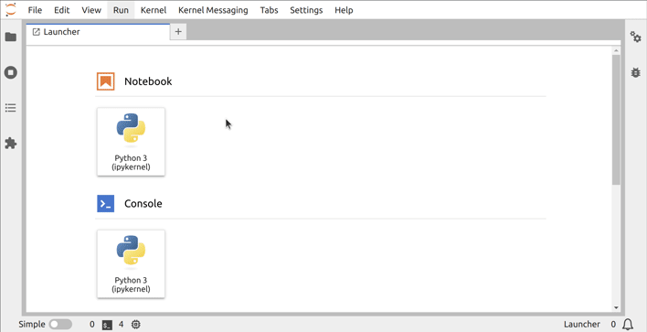

# Kernel Messaging

> Interact with a kernel from an extension.

- [Component Overview](#component-overview)
- [Initializing and managing a kernel session (panel.ts)](#initializing-and-managing-a-kernel-session-panelts)
- [Executing code and retrieving messages from a kernel (model.ts)](#executing-code-and-retrieving-messages-from-a-kernel-modelts)
- [Connecting a View to the Kernel](#connecting-a-view-to-the-kernel)



## Custom Kernel Interactions: Kernel Management and Messaging

One of the main features of JupyterLab is the possibility to manage and
interact with [kernels](https://jupyter-client.readthedocs.io/en/latest/kernels.html).
In this example, you will explore how to
start a kernel and send some code to be executed by it.

## Component Overview

This example is structured in four files:

- `index.ts`: the JupyterLab frontend plugin that initializes the plugin and registers commands, add a menu entry and a launcher item
- `panel.ts`: a panel class that is responsible to initialize and hold the kernel session, widgets and model
- `model.ts`: a KernelModel class that is responsible to execute code on the kernel and to store the execution result
- `widget.tsx`: a KernelView class that is responsible to provide visual elements that trigger the kernel model and display its results

The `KernelView` displays the `KernelModel` thanks to some React HTML elements and
gets updated when the `KernelModel` state changes, i.e. retrieves a new
execution result.

## Initializing and managing a Kernel Session (`panel.ts`)

Jupyterlab provides a class `SessionContext`
([see the documentation](https://jupyterlab.github.io/jupyterlab/classes/_apputils_src_index_.sessioncontext.html))
that manages a single kernel session. Here is the code to initialize such session:

```ts
// src/panel.ts#L41-L45

this._sessionContext = new SessionContext({
  sessionManager: manager.sessions,
  specsManager: manager.kernelspecs,
  name: 'Extension Examples'
});
```

<!-- prettier-ignore-start -->
<!-- embedme src/panel.ts#L56-L67 -->

```ts
void this._sessionContext
  .initialize()
  .then(async value => {
    if (value) {
      await this._sessionContextDialogs.selectKernel(this._sessionContext);
    }
  })
  .catch(reason => {
    console.error(
      `Failed to initialize the session in ExamplePanel.\n${reason}`
    );
  });
```
<!-- prettier-ignore-end -->

The session manager object is
provided directly by the JupyterLab application:

```ts
// src/index.ts#L46-L46

const manager = app.serviceManager;
```

With these lines, you can extend the panel widget from the [signal example](../signals) to initialize a
kernel. In addition, you will create a `KernelModel` class in it and
overwrite the `dispose` and `onCloseRequest` methods of the `StackedPanel`
([see the documentation](https://lumino.readthedocs.io/en/stable/api/classes/widgets.StackedPanel-1.html))
to free the kernel session resources if the panel is closed. The whole adapted
panel class looks like this:

```ts
// src/panel.ts#L31-L91

export class ExamplePanel extends StackedPanel {
  constructor(manager: ServiceManager.IManager, translator?: ITranslator) {
    super();
    this._translator = translator || nullTranslator;
    this._trans = this._translator.load('jupyterlab');
    this.addClass(PANEL_CLASS);
    this.id = 'kernel-messaging-panel';
    this.title.label = this._trans.__('Kernel Messaging Example View');
    this.title.closable = true;

    this._sessionContext = new SessionContext({
      sessionManager: manager.sessions,
      specsManager: manager.kernelspecs,
      name: 'Extension Examples'
    });

    this._model = new KernelModel(this._sessionContext);
    this._example = new KernelView(this._model);

    this.addWidget(this._example);

    this._sessionContextDialogs = new SessionContextDialogs({
      translator: translator
    });

    void this._sessionContext
      .initialize()
      .then(async value => {
        if (value) {
          await this._sessionContextDialogs.selectKernel(this._sessionContext);
        }
      })
      .catch(reason => {
        console.error(
          `Failed to initialize the session in ExamplePanel.\n${reason}`
        );
      });
  }

  get session(): ISessionContext {
    return this._sessionContext;
  }

  dispose(): void {
    this._sessionContext.dispose();
    super.dispose();
  }

  protected onCloseRequest(msg: Message): void {
    super.onCloseRequest(msg);
    this.dispose();
  }

  private _model: KernelModel;
  private _sessionContext: SessionContext;
  private _example: KernelView;
  private _sessionContextDialogs: SessionContextDialogs;

  private _translator: ITranslator;
  private _trans: TranslationBundle;
}
```

## Executing code and retrieving messages from a Kernel (`model.ts`)

Once a kernel is initialized and ready, code can be executed with the following snippet:

```ts
// src/model.ts#L46-L48

this.future = this._sessionContext.session?.kernel?.requestExecute({
  code
});
```

`future` is an object that can receive some messages from the kernel as a
reply to your execution request (see [jupyter messaging](https://jupyter-client.readthedocs.io/en/stable/messaging.html)).
One of these messages contains the data of the execution result. It is
published on a channel called `IOPub` and can be identified by the message
types `execute_result`, `display_data` and `update_display_data`.

Once such a message is received by the `future` object, it can trigger an
action. In this case, that message is stored in `this._output`. Then
a `stateChanged` signal is emitted.
The `KernelModel` has a `stateChanged` signal that will be used by the
view. It is implemented as follows:

```ts
// src/model.ts#L9-L74

export class KernelModel {
  constructor(session: ISessionContext) {
    this._sessionContext = session;
  }

  get future(): Kernel.IFuture<
    KernelMessage.IExecuteRequestMsg,
    KernelMessage.IExecuteReplyMsg
  > | null {
    return this._future;
  }

  set future(
    value: Kernel.IFuture<
      KernelMessage.IExecuteRequestMsg,
      KernelMessage.IExecuteReplyMsg
    > | null
  ) {
    this._future = value;
    if (!value) {
      return;
    }
    value.onIOPub = this._onIOPub;
  }

  get output(): IOutput | null {
    return this._output;
  }

  get stateChanged(): ISignal<KernelModel, void> {
    return this._stateChanged;
  }

  execute(code: string): void {
    if (!this._sessionContext || !this._sessionContext.session?.kernel) {
      return;
    }
    this.future = this._sessionContext.session?.kernel?.requestExecute({
      code
    });
  }

  private _onIOPub = (msg: KernelMessage.IIOPubMessage): void => {
    const msgType = msg.header.msg_type;
    switch (msgType) {
      case 'execute_result':
      case 'display_data':
      case 'update_display_data':
        this._output = msg.content as IOutput;
        console.log(this._output);
        this._stateChanged.emit();
        break;
      default:
        break;
    }
    return;
  };

  private _future: Kernel.IFuture<
    KernelMessage.IExecuteRequestMsg,
    KernelMessage.IExecuteReplyMsg
  > | null = null;
  private _output: IOutput | null = null;
  private _sessionContext: ISessionContext;
  private _stateChanged = new Signal<KernelModel, void>(this);
}
```

## Connecting a View to the Kernel

Now that the session is created and the model is defined, the view can
be connected to the model to display the execution results.

In this example, the view contains a `UseSignal` React element that listens
to the `stateChanged` signal defined by the model. Whenever the `stateChanged`
signal is emitted, the `UseSignal` React element will update its children
according to the new state of the model. In this example the execution
results are retrieved through `this._model.output` attribute and display
in a text field.

<!-- prettier-ignore-start -->
```ts
// src/widget.tsx#L25-L29

<UseSignal signal={this._model.stateChanged}>
  {(): JSX.Element => (
    <span key="output field">{JSON.stringify(this._model.output)}</span>
  )}
</UseSignal>
```
<!-- prettier-ignore-end -->

Finally to trigger a statement execution, the click event of a button is
implemented to call the `this._model.execute` method.

```ts
// src/widget.tsx#L16-L24

<button
  key="header-thread"
  className="jp-example-button"
  onClick={(): void => {
    this._model.execute('3+5');
  }}
>
  Compute 3+5
</button>
```

## Where to Go Next

In the [Kernel Output](../kernel-output)
example, you will explore how you can reuse some Jupyter components to have a nicer display for kernel messages.

This example uses React to define UI elements. You can
learn more about React in JupyterLab in [that example](../react-widget/README.md).

The UI refresh is triggered by signal emissions. To know more about it,
you can have a look at the [signal example](../signals/README.md).
