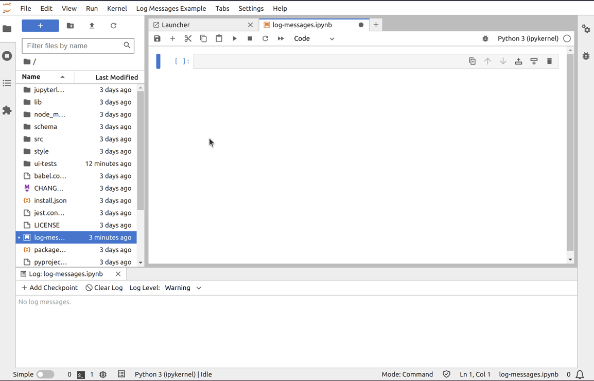

# Log message

> Send a log message to the log console.

This is a basic example to show how to send different types of log message to the log console from a JupyterLab extension.



The default log console extension in JupyterLab obtains log outputs from the kernel context of the current active notebook. That let the log console change the source input once a new notebook is opened. There are different ways to approach the problem:

1. Obtain the current active notebook and send message to his `Logger` instance (covered in this example).
2. Create your custom log console (see the [custom log console](https://github.com/jupyterlab/extension-examples/tree/master/custom-log-console) example).

> It is strongly recommended to read [main-menu](https://github.com/jupyterlab/extension-examples/tree/master/main-menu) example before diving into this one.

To implement this example you need to install the following packages:

- `@jupyterlab/logconsole`: Where you will find the classes and interfaces to work with the log console.
- `@jupyterlab/notebook`: Where you will find the different classes and interfaces to work with notebooks.
- `@jupyterlab/nbformat`: Only necessary if you want to use the notebook output format as the type of message.

First of all, you will start looking into the declaration of the extension:

<!-- prettier-ignore-start -->
```ts
// src/index.ts#L8-L17


const extension: JupyterFrontEndPlugin<void> = {
  id: '@jupyterlab-examples/log-messages:plugin',
  autoStart: true,
  requires: [ILoggerRegistry, INotebookTracker, ISettingRegistry],
  activate: (
    app: JupyterFrontEnd,
    loggerRegistry: ILoggerRegistry,
    nbtracker: INotebookTracker
  ) => {
```
<!-- prettier-ignore-end -->

For this extension, you need to require `ILoggerRegister` to search for the logger of the active notebook and `INotebookTracker` to obtain the active notebook.

The first step is to obtain the logger of the active notebook. You can use `loggerRegistry.getLogger()` which needs a `source`. The `source` refers to the context's path of the active notebook. You can obtain it using the notebook tracker referenced as `nbtracker` here.

<!-- prettier-ignore-start -->
```ts
// src/index.ts#L23-L25

const logger = loggerRegistry.getLogger(
  nbtracker.currentWidget?.context.path || ''
);
```
<!-- prettier-ignore-end -->

Finally, you can send log messages by calling the `log` method of the `logger` object. This method lets you send different types of logs like `IHtmlLog`, `ITextLog` and `IOutputLog`.

<!-- prettier-ignore-start -->
```ts
// src/index.ts#L28-L34

const msg: ITextLog = {
  type: 'text',
  level: 'info',
  data: 'Hello world text!!'
};

logger?.log(msg);
```
<!-- prettier-ignore-end -->

It is worth noting that with this approximation you will only be able to send messages to the log console if you have a notebook opened. If you have more than one notebook opened, the messages will be sent to the active notebook or the most recently focused notebook. It means that if you are changing from one notebook to another, every message will be sent to a different source and will be shown when the notebook gets the focus.

Examples of other types of messages can be seen in the [custom log console](https://github.com/jupyterlab/extension-examples/tree/master/custom-log-console) example.
