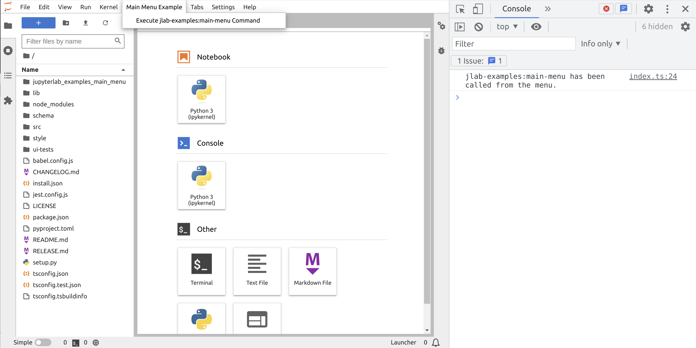

# Menus

> Add a Menu to the main app.



One major concept of the Lumino library on which JupyterLab is built is
the notion of _Commands_ as explained in the [commands example](../commands/README.md).
One of the possibilities offered to the user to trigger that command is to call it from
a menu item.

Since JupyterLab 3.1, the preferred way to define menus is through a description
stored in plugin settings file. On the Typescript code, you only need
to define the _commands_ to be displayed in the menu(s). The code to add
a command will first be described.

<!-- prettier-ignore-start -->
```ts
// src/index.ts#L17-L32

const { commands } = app;

// Add a command
const command = 'jlab-examples:main-menu';
commands.addCommand(command, {
  label: 'Execute jlab-examples:main-menu Command',
  caption: 'Execute jlab-examples:main-menu Command',
  execute: (args: any) => {
    console.log(
      `jlab-examples:main-menu has been called ${args['origin']}.`
    );
    window.alert(
      `jlab-examples:main-menu has been called ${args['origin']}.`
    );
  }
});
```
<!-- prettier-ignore-end -->

Now that the command is defined, you need to add the definition of the menu
in the plugin settings file.

> Tip: when using the cookiecutter template for JupyterLab extension, you can
> request initial settings to be created.

The creation of a settings file is described in the [settings example](../settings/README.md). Here only the needed keys to add a menu will describe.

<!-- prettier-ignore-start -->

```json5
// schema/plugin.json#L4-L20

"jupyter.lab.menus": {
  "main": [
    {
      "id": "jp-mainmenu-example-menu",
      "label": "Main Menu Example",
      "rank": 80,
      "items": [
        {
          "command": "jlab-examples:main-menu",
          "args": {
            "origin": "from the menu"
          }
        }
      ]
    }
  ]
},
```

<!-- prettier-ignore-start -->

Main menu can be added and edited through the `main` property of the special
key `jupyter.lab.menus`. That property accepts a list of menus; each item will
have an entry in the main menu bar.

A menu is described by:

- an `id`: Unique menu identifier
- a `label`: The text to be displayed in the menu bar
- some `items`: The commands available under that menu
- a `rank`: (optional) number to order the menu items in the menu bar

The `items` are a list of objects with the following attributes:

- `type`: Type of the item
  - _command_: (default) If the item triggers a command
  - _separator_: if the item is a menu separator
  - _submenu_: if the item is a submenu
- `command`: (needed for _command_ type item) the unique command id to be trigger by the menu entry
- `args`: (optional for _command_ item) arguments to be passed to the _command_
- `rank`: (optional) number to order the menu entries

The label displayed for a command will be given by the `label` attribute
coded in Typescript; in this example:

<!-- prettier-ignore-start -->
```ts
// src/index.ts#L22-L22

label: 'Execute jlab-examples:main-menu Command',
```
<!-- prettier-ignore-end -->

To add items to an existing menu, you will need to use the `id` of the default menu.
An example to add an item to the _New_ submenu of the _File_ menu is available in the
[launcher example](../launcher/schema/plugin.json).

The list of default menu `id`s is available in the [documentation](https://jupyterlab.readthedocs.io/en/stable/extension/extension_points.html#settings-defined-menu).

> See also the [documentation](https://jupyterlab.readthedocs.io/en/stable/extension/extension_points.html#settings-defined-menu).

**WARNING** The extension id must contain the package name and the schema file name:

<!-- prettier-ignore-start -->
```ts
// src/index.ts#L12-L12

id: '@jupyterlab-examples/main-menu:plugin',
```
<!-- prettier-ignore-end -->

- `@jupyterlab-examples/main-menu` is the package name in `package.json` file
- `:plugin` come from the schema file `schema/plugin.json`

With this extension installed, a new menu _Main Menu Example_ should be present. And when
clicking on the menu item _jlab-examples:main-menu_, the following text should appear
in the web browser console.

```
jlab-examples:main-menu has been called from the menu.
```
