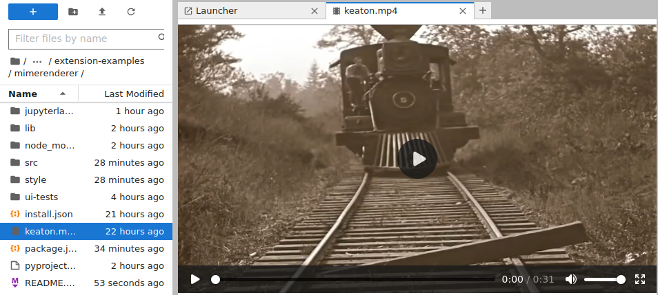

# MIME renderer

> This was originally archive at https://github.com/jupyterlab/jupyterlab-mp4.

The [MIME type](https://developer.mozilla.org/en-US/docs/Web/HTTP/Basics_of_HTTP/MIME_types)
of a data source is a standard way to indicate the type of that data.
JupyterLab (and Project Jupyter as a whole) make
[wide use](https://jupyter-client.readthedocs.io/en/stable/messaging.html#display-data)
of MIME types to decide how to render data.

This tutorial will teach you how to make a
[mimerenderer extension](https://jupyterlab.readthedocs.io/en/3.6.x/extension/extension_dev.html#mime-renderer-plugins)
for JupyterLab.
These extensions are simpler to write than full-fledged JupyterLab extensions,
and are focused around adding the ability to render new MIME types to the application.
Specifically, you will be adding the ability for Jupyter Lab to render mp4 videos.



> It is strongly recommended to read the [basic hello-world](../hello-world)
> example before diving into this one.

## The template folder structure

You will initialize the extension by using [copier](https://copier.readthedocs.io).
Execute the following commands in your terminal:

```bash
pip install copier jinja2-time
mkdir my_mimerenderer
cd my_mimerenderer
copier copy --trust https://github.com/jupyterlab/extension-template .
```

You will be asked for some basic information that could for example be setup
like this (be careful to pick _mimerenderer_ as _kind_):

```bash
🎤 What is your extension kind?
   mimerenderer
🎤 Extension author name
   tuto
🎤 Extension author email
   tuto@help.you
🎤 JavaScript package name
   mp4-renderer-example
🎤 Python package name
   mp4_renderer_example
🎤 Extension short description
   A JupyterLab MIME renderer example for mp4.
🎤 Do you want to set up Binder example?
   Yes
🎤 Do you want to set up tests for the extension?
   Yes
🎤 Git remote repository URL
   https://github.com/github_username/mp4-renderer-example
🎤 What is the MIME type viewer name?
   JupyterLab mp4 viewer
🎤 MIME type
   video/mp4
🎤 MIME type name
   mp4
🎤 MIME type file extension
   .mp4
🎤 MIME type content format
   string
```

> See [hello-world](../hello-world/README.md) example for a description of the file generated.

## Build and install the extension

Your new extension extension has enough code in it to see it working in
JupyterLab. Run the following commands to install the extension and its
dependencies.

```bash
pip install -e .
jupyter labextension develop --overwrite .
```

Once the installation completes, run this command to watch your extension code for
changes so that it can recompile them as soon as you make them:

```bash
jlpm run watch
```

Now, open a second terminal and run this command to start a JupyterLab instance:

```bash
jupyter lab
```

When the watch process incorporates changes, you can refresh the page to see them take effect.

This example comes with a mp4 video, _keaton.mp4_, that you can use for testing.

## Browse the code

Now let's take a look at the core code for this extension.
There are three main data structures in `src/index.ts`:

1. The `VideoWidget` class: This is the class that takes the data of your MIME type and knows how to render it to an HTML DOM node. This contains most of the logic for the extension.
2. The `rendererFactory` object: This object knows how to create new instances of the `VideoWidget` class for use in the application.
3. The `extension` plugin object: This is the main entry point for your extension. It describes the metadata necessary for JupyterLab to load and use the extension.

### The plugin

The plugin defines 4 elements.

```ts
// src/index.ts#L62-L62

rendererFactory,
```

The `rendererFactory` is the entry point of your renderer that will receive
the file content model and will instantiate a `Widget` to be displayed in
the application.

```ts
// src/index.ts#L64-L64

dataType: 'string',
```

The `dataType` determines if the file content is a generic string or a parsable JSON object. In this case, the content is binary and will be
sent as a [base64](https://developer.mozilla.org/en-US/docs/Web/API/WindowBase64/Base64_encoding_and_decoding) string from the server to the frontend.

```ts
// src/index.ts#L65-L76

fileTypes: [
  {
    name: 'mp4',
    extensions: ['.mp4'],
    fileFormat: 'base64',
    icon: {
      name: '@jupyterlab-examples/mimerenderer:video',
      svgstr: movieIcon
    },
    mimeTypes: [MIME_TYPE]
  }
],
```

The `fileTypes` is the set of file types that can be rendered with by
the extension. In this specific case, the `fileFormat` is specified as
`base64`. So the file binary content can be received from the server.

And custom `icon` is also specified by providing an unique icon identifier
and the icon as a SVG string. The SVG file icon will be inline in the web
page allowing to be customized the theme without a need to provide a new
version of the icon.

```ts
// src/index.ts#L77-L83

documentWidgetFactoryOptions: {
  name: 'JupyterLab mp4 Viewer',
  primaryFileType: 'mp4',
  modelName: 'base64',
  fileTypes: ['mp4'],
  defaultFor: ['mp4']
}
```

Finally the `documentWidgetFactoryOptions` are needed to instantiate a
document from the file content. In particular it needs an unique `name`
and refers to the supported `fileTypes` (by its name). The file model
must also be specified here as the file content is of type `base64` and
not `string`.

## Render the video

To render the video in the DOM, a [`video`](https://developer.mozilla.org/en-US/docs/Web/HTML/Element/video) element is inserted within the widget `node`.

```ts
// src/index.ts#L28-L30

this._video = document.createElement('video');
this._video.setAttribute('controls', '');
this.node.appendChild(this._video);
```

Then the file content is used to set the video element source as a
[data URL](https://developer.mozilla.org/en-US/docs/Web/HTTP/Basics_of_HTTP/Data_URIs):

```ts
// src/index.ts#L37-L38

let data = model.data[this._mimeType] as string;
this._video.src = `data:${MIME_TYPE};base64,${data}`;
```

## Style the video

To improve the sizing of the video in its input frame, some
style rules are added:

```css
/* style/base.css#L7-L14 */
```

## Where to Go Next

JupyterLab User Interface is built on top of widget. You can have more details
about them in the the [widgets example](../widgets).
